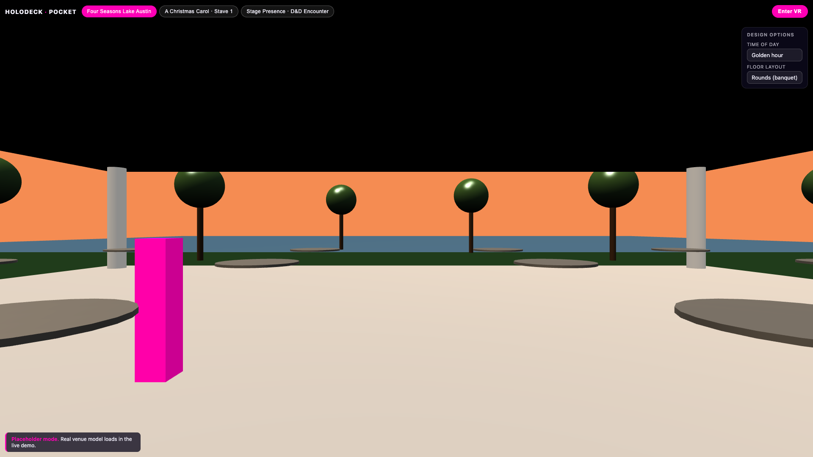
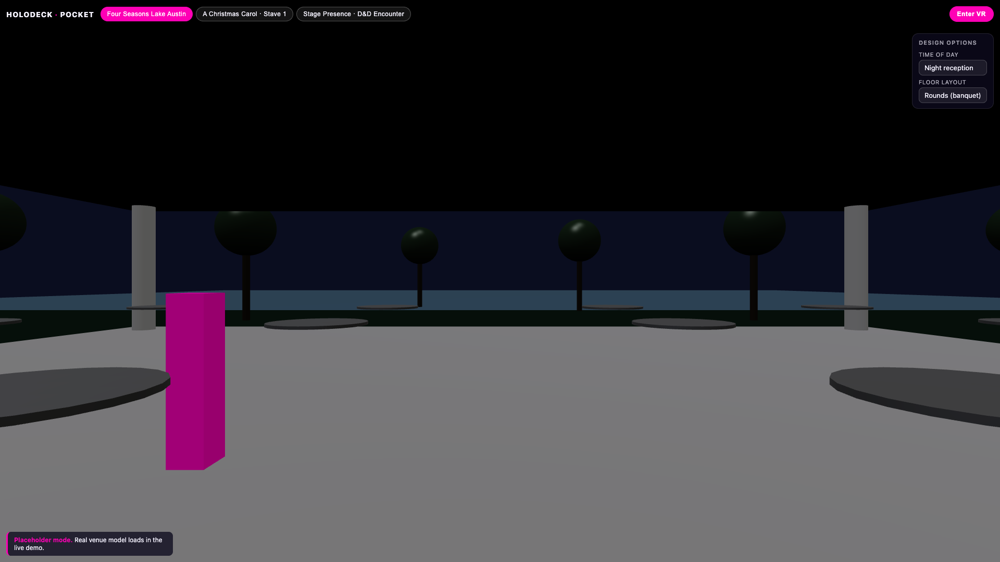
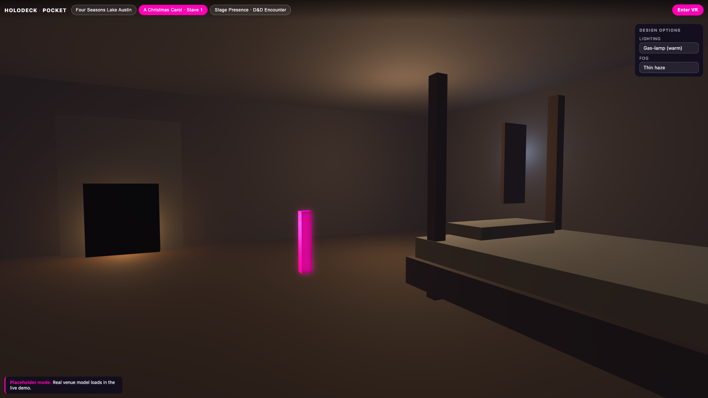
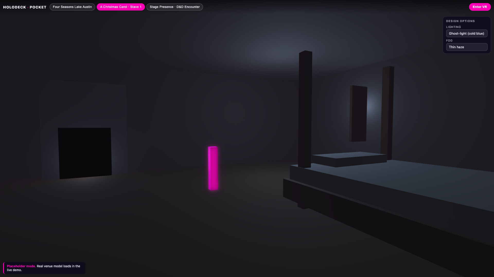
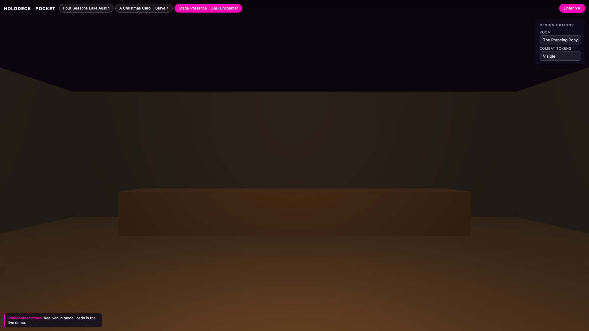
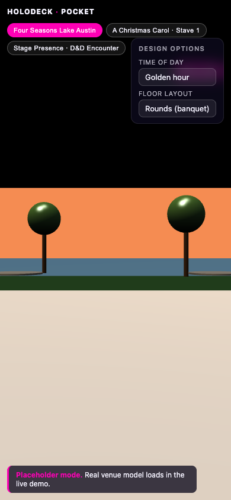
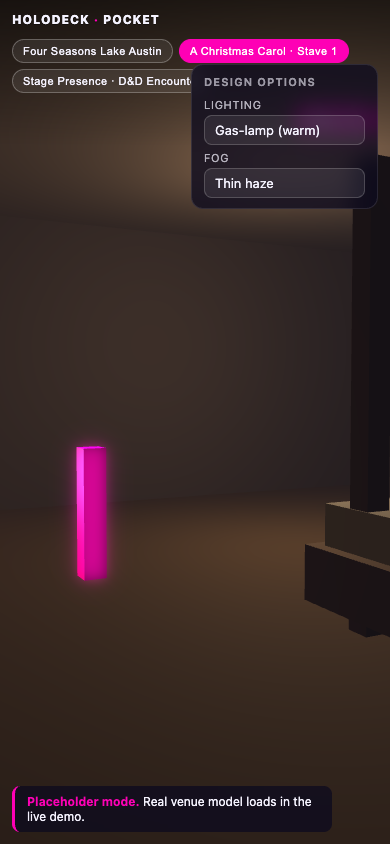
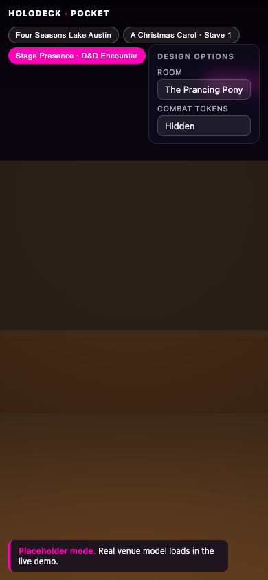

# Holodeck-in-a-Pocket

> Scan, walk, look around. A no-install WebXR demo for FMX 2026 + NXT BLD 2026.

A static web app that lets an audience member point their phone camera at a QR code mid-talk and walk through a virtual venue. Three pre-built scenes share one engine; each scene exposes a couple of design-option toggles (lighting, layout, materials) — the productization punchline.

Built with **Babylon.js** + **TypeScript** + **Vite**, deployed to GitHub Pages.

**Live:** _added on first successful deploy_ → `https://ibrews.github.io/holodeck-pocket/`

QR code: see [`qr.png`](qr.png) and [`qr.svg`](qr.svg).

## Screenshots

### Four Seasons Lake Austin

| Desktop — Golden hour | Desktop — Night reception |
|---|---|
|  |  |

### A Christmas Carol — Stave 1

| Desktop — Gas-lamp | Desktop — Ghost-light |
|---|---|
|  |  |

### Stage Presence — D&D Encounter

| Desktop — Tavern | Desktop — Combat tokens visible |
|---|---|
|  |  |

### Phone view (390×844)

| Four Seasons | Carol | D&D |
|---|---|---|
|  |  |  |

---

## Scenes

| Slug | URL fragment | Anchor for |
|------|--------------|-----------|
| Four Seasons Lake Austin | `#scene=four-seasons` | NXT BLD 2026 (event venue) |
| A Christmas Carol — Stave 1 | `#scene=carol` | FMX 2026 (spatial storytelling) |
| Stage Presence — D&D | `#scene=dnd` | both (productization story) |

All current geometry is **clean placeholders** in brand colors. The plan is to swap real venue / set geometry in before each event, scene-by-scene.

## Things to Try

1. **Open the deployed URL on your phone** and walk around the Four Seasons pavilion — drag the joystick (bottom-left) to move, drag the right side of the screen to look.
2. **Visit `/#scene=carol`** (Christmas Carol — Stave 1) and switch the **Lighting** option from `Gas-lamp` to `Ghost-light` and then to `Dying ember`. Same room, three completely different moods — that's the BPI productization punchline in 6 seconds.
3. **Visit `/#scene=dnd`** and toggle **Combat tokens** from Hidden to Visible while in the dungeon room — the encounter grid pops in.
4. **Switch the Four Seasons "Floor layout"** between rounds, theater, and open mingle to see how the same venue model adapts to different event types.
5. **On a Quest browser**, tap **Enter VR** in the top-right (when supported) — same scene, immersive.

## Run locally

```bash
npm install
npm run dev          # http://localhost:5173/
npm run build        # static bundle in dist/
npm run preview      # serve the built bundle
npm run typecheck    # tsc --noEmit
npm run qr -- https://ibrews.github.io/holodeck-pocket/
```

## How to add a new scene

1. Create `src/scenes/<slug>.ts` exporting a `SceneDefinition` (see `four-seasons.ts` as the template):
   ```ts
   const myDef: SceneDefinition = {
     id: "my-scene",        // becomes #scene=my-scene
     title: "My Scene",
     subtitle: "...",
     placeholder: true,     // shows the "Real venue model loads in the live demo" note
     options: [{ id: "...", label: "...", choices: [...], default: "..." }],
     build(engine) {
       // create Scene, lights, geometry, attach Controls(scene, canvas, spawn, lookAt)
       // return { scene, camera, meshes, applyOption, dispose }
     },
   };
   export default myDef;
   ```
2. Register it in `src/main.ts` by importing it and adding to the `SCENES` map. Also add the slug to the `SceneId` union in `src/types.ts`.
3. (Optional) Update `SceneId` to include the new slug for type-safety, and append a row to the table above.

The shared `Controls` (in `src/controls.ts`) handles WASD + mouse on desktop, joystick + look-pad on touch, and the `WebXRDefaultExperience` wires up automatically in `main.ts` if the device supports it.

## Asset strategy

For now: clean placeholders in brand colors (`#FE00B5`, `#3500A7`) with explicit "PLACEHOLDER" labels and a UI note (`Real venue model loads in the live demo`). Avoiding fake plausible-but-wrong renders.

Real geometry can be dropped under `public/models/<slug>/` and loaded with `SceneLoader.ImportMeshAsync` (loaders are already imported via `@babylonjs/loaders/glTF`).

## Deployment

GitHub Actions (`.github/workflows/deploy.yml`) auto-deploys to GitHub Pages on every push to `main`. The Pages URL is `https://ibrews.github.io/holodeck-pocket/`.

The repo is **private until after May 13, 2026** (post-NXT BLD). GitHub Pages on private repos requires a Pro/Team plan. If Pages on private isn't available on the `ibrews` plan, the fallback is Cloudflare Pages with a custom subdomain on `agilelens.com`.

## Verification log

`verification/` holds dated screenshots and one-line notes per platform.

## License

Source code: private — internal AgileLens / BPI. Do not redistribute.

All third-party 3D models — see [LICENSES.md](./LICENSES.md) for per-model attribution.
